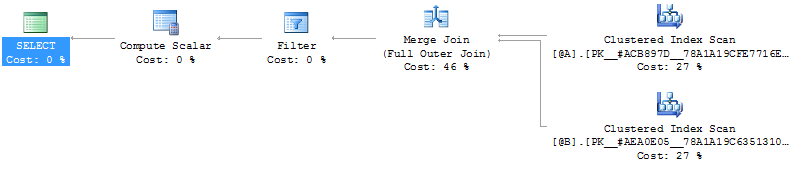

# 2015-05-26 DIFFERENCE in MS SQL

tags: MSSQL, sql

So, if I had two sets, A and B, and wanted to get all items that are in A but not B, as well as items in B but not A (i.e. the opposite of an intersection), I would have thought I could just do:

```sql
SELECT * FROM A
DIFFERENCE
SELECT * FROM B
```

Maybe my memory is failing me, but I thought there was a standard SQL difference operator, but after briefly looking around it seems there isn't.

It is possible though, using:

1. `EXCEPT`
2. `FULL OUTER JOIN`

I just tried it with table variables, set up as below (seems we get the same result with actual tables, but table variables are easier for demo purposes :B)

```sql
DECLARE @A TABLE (
    Number INT NOT NULL PRIMARY KEY
);

DECLARE @B TABLE (
    Number INT NOT NULL PRIMARY KEY
);

INSERT INTO @A (Number) VALUES (2), (4), (6), (8);
INSERT INTO @B (Number) VALUES (1), (2), (3), (5), (8);
```

The `EXCEPT` way:

```sql
(
    (SELECT * FROM @A)
    EXCEPT
    (SELECT * FROM @B)
)
UNION
(
    (SELECT * FROM @B)
    EXCEPT
    (SELECT * FROM @A)
);
```

Quite verbose, but pretty easy to follow. The `FULL OUTER JOIN` way is also pretty easy to follow:

```sql
SELECT
    CASE
        WHEN a.Number IS NULL THEN b.Number
        ELSE a.Number
    END
FROM
    @A a
FULL OUTER JOIN
    @B b
    ON a.Number = b.Number
WHERE
    (A.Number IS NULL AND B.Number IS NOT NULL)
    OR
    (A.Number IS NOT NULL AND B.Number IS NULL);
```

This is probably less easy to maintain, because you have to specifically reference the columns to match on, as well as choose which set to select values from, as is being done in the case statement. This could probably become a bit unwieldly for a table with lots of columns, and hopefully you don't mess up the NULL checks.

I did try this out on a query on a customers database though, and found that the full outer join method can be faster. Below are the execution plans for the two queries:


<br/><br/>


So, if I'm reading that right, it's having to go through each table more than once in the `EXCEPT` case, and only once in the `FULL OUTER JOIN`, which can make quite the... `DIFFERENCE`... (sorry couldn't help but make that pun :D).
