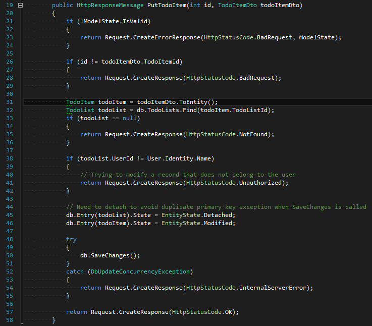
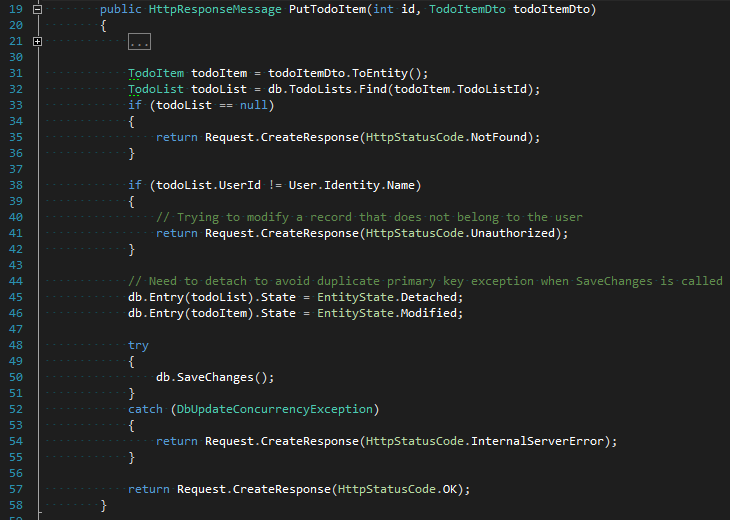
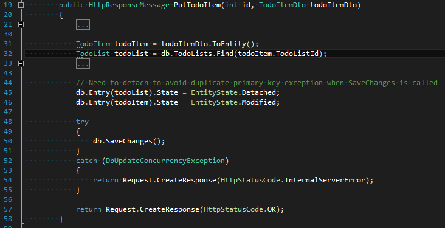

# 2015-07-21 Visual Studio tip: Hide selected text

tags: tips, Visual Studio

Today I noticed the menu item Edit > Outlining > Stop Hiding Current (CTRL+M CTRL+U), and wondered to myself what it does. Well, turns out you can hide selected areas of text and then later unhide them. But how do you hide them in the first place??

> "The option to hide a selection only shows in the Outlining menu once you've selected text" - Captain Obvious

Thank you Captain Obvious!

So as an example, lets say we have one of the controllers for a sample ASP.NET MVC project, and just want to inspect it to see what it does, we see the below action with a long bunch of lines:

We go through the first few lines and realise that's all just code related to validation, followed by loading up an item and some more validation. We're not really interested in the validation just yet so we can just collapse it by selecting those lines, and going Edit > Outlining > Hide Selection (or if like me you like keyboard shortcuts, CTRL+M followed by CTRL+H). We now can see what the method's actually trying to do, and can easily ignore the validation code for now:

  

If later you do want to see the folded stuff, it's as easy as expanding the code again. It seems that VS remembers this custom code folding section for later on when I close and open the file, and even after closing VS itself (though I wouldn't rely on it to be there forever... I'm guessing it's stored in some local user settings file).

I've seen people use the #region directive a lot for this kind of thing - making the code easier to read - but then someone else who doesn't like #regions will delete it later, or someone will restructure it. The advantage of doing this is that it doesn't affect anyone else on your team.

To remove the custom code folded section, just do the opposite, Edit > Outlining > Stop Hiding Current (CTRL+M CTRL+U) ... H for hide, U for unhide.

Another use case for this would be doing code reviews, or maybe if you're presenting pieces of code that you don't want the audience to read and get too far ahead of the presentation.

