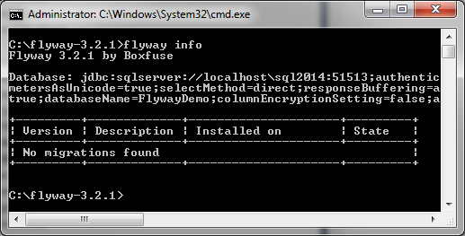
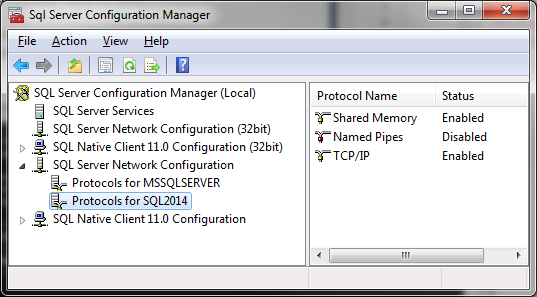
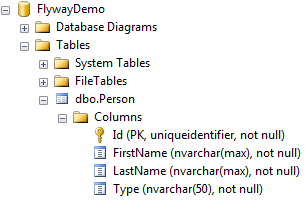
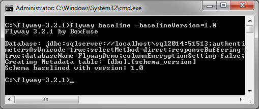
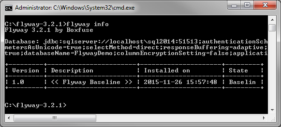
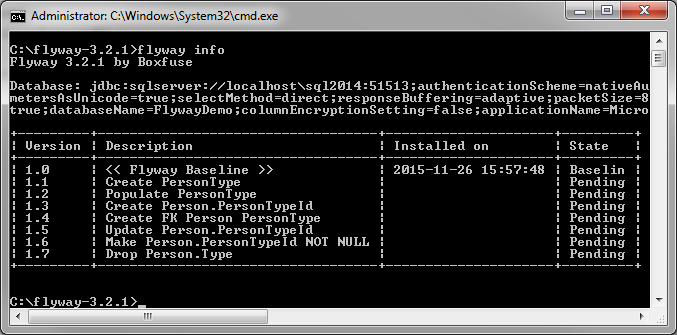
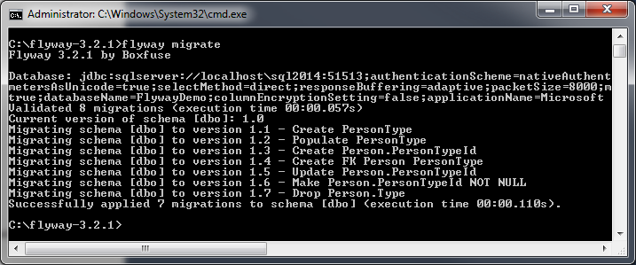
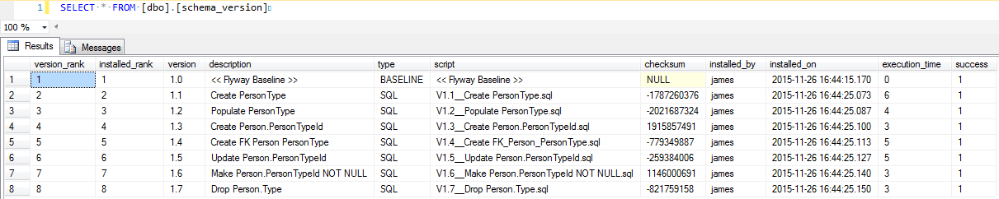
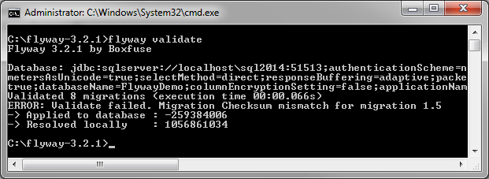
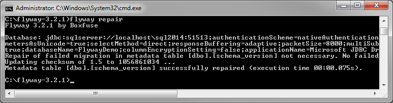

# 2015-12-02 Getting started with automating database changes using Flyway

tags: databases, evolutionary database design, Flyway, patch scripts, refactoring, refactoring databases, versioning databases

#### Intro

For those of us that strive to get to a "One Click Deploy" - where we press a magical button that automatically deploys all of our changes - one of the stumbling blocks during deployment is if there is a relational database involved where schema and/or data changes still need to be run manually.

For those of us that strive to get to a "One Click Deploy" - where we press a magical button that automatically deploys all of our changes - one of the stumbling blocks during deployment is if there is a relational database involved where schema and/or data changes still need to be run manually.

I spoke about the general idea behind database migration strategies at one of Entelect's dev days, and the concepts are still the same (see the end of this article for some references). Since then, there are two tools that I've become aware of: [Liquibase](http://www.liquibase.org/) and [Flyway](https://flywaydb.org/). This will go through using Flyway with SQL Server 2014.

#### Setup Flyway

Flyway is a Java based library, but also comes as a standalone [command line](http://flywaydb.org/documentation/commandline/) tool. I think that means you don't need to install the Java Runtime Environment (JRE) to use it, but I already had it installed so haven't verified that yet.

1. Go to the [Flyway command line](http://flywaydb.org/documentation/commandline/) page
    - Download flyway-commandline-3.2.1.zip
    - Unzip to C:\flyway-3.2.1

Since we're using SQL Server, we also need to make sure the right JDBC drivers are available for Flyway to use. Although the [documentation](http://flywaydb.org/documentation/database/sqlserver.html) does show support for using both the [Microsoft](https://msdn.microsoft.com/en-us/library/mt484311(v=sql.110).aspx) and [jTDS drivers](http://jtds.sourceforge.net/), I found that the jTDS library doesn't support Windows Authentication mode for SQL Server 2014 (it might for older versions), and I had to download and set up the Microsoft driver in any case:

1. Go to the [Microsoft JDBC driver download](https://www.microsoft.com/en-za/download/details.aspx?id=11774) page
    - Download either sqljdbc_6.0.6629.101_enu.exe or the sqljdbc_6.0.6629.101_enu.tar.gz tarball (I chose the latter)
    - Unzip the tarball
    - [Choose the right JAR](https://msdn.microsoft.com/en-us/library/ms378422(v=sql.110).aspx) depending on Java version and JDBC compliance, I went with sqljdbc42.jar, and copy this into C:\flyway-3.2.1\drivers
    - Since we need Windows Authentication, copy sqljdbc_auth.dll into a folder on the PATH
    - I copied it into C:\flyway-3.2.1 since I'll run the command line tool from that location

There are a few configuration options available, but for now we'll just need to setup our connection string and driver in C:\flyway-3.2.1\conf\flyway.conf:

```
flyway.url=jdbc:sqlserver://localhost;instanceName=sql2014;database=FlywayDemo;integratedSecurity=true
flyway.driver=com.microsoft.sqlserver.jdbc.SQLServerDriver
```

Technically you shouldn't need to specifiy the driver explicitly, but I prefer being explicit to avoid surprises. In the above connection, I'm connecting to a database FlywayDemo on a named instance called sql2014, and making use of integrated security (Windows Authentication).

You should now be able to run the command below to verify that Flyway can connect to the DB:



The above shows that it can connect to the database, and that there were no migrations found (we will start with that next). You shouldn't get any errors at this stage, though you may need to configure your database to allow TCP connections if it hasn't been configured to do so already:



#### Baseline

If you're lucky enough to work on a brand new project with a brand new database, you can just create an empty database, and each change to the database can be created as a new script, each run in order.

But most of us have an existing database we want to work from. For this demo, I'll just use a simple database with a single table as below:



We can use Flyway to baseline this version of the database, say, version 1.0:



This creates a new database table `schema_version` in the default schema of the database, and tags the database as version `1.0`. We could create a backup of this database, and use it as our baseline database to work off of, and when another user restores the database backup, they can use flyway to inspect what version of the database they are using:



#### Database migration changes

With Flyway, each change to the database should be scripted as an incremental change. This allows us to migrate database changes forward from whatever current version our database is at. Flyway uses specific [conventions](https://flywaydb.org/documentation/migrations) for database migration scripts, and we'll follow the default. Scripts are to be placed in the folder `C:\flyway-3.2.1\sql`, and follow the naming convention `prefixVERSIONseparatorDESCRIPTIONsuffix`, e.g. `V1.1__Some description.sql`.

Lets say we want to change our database structure to extract the Type column of the Person table into its own table. This would involve:

1. Creating a new table, PersonType
    - Inserting necessary data into PersonType
    - Adding a new PersonTypeId foreign key to Person
    - Updating the Person data for the new PersonTypeId
    - Dropping the old Type column on the Person table

We could lump all of these in a new V1.1 script, however the recommended practice is to split each DDL change into its own version, since some database vendors don't handle transactions very well with DDL statements, and Flyway tries to wrap each migration in a transaction so if any migration fails it doesn't leave the database in an inconsistent state.

Instead, we'll just make each change it's own script, by default:

- V1.1__Create PersonType.sql
    - V1.2__Populate PersonType.sql
    - V1.3__Create Person.PersonTypeId.sql
    - V1.4__Create FK_Person_PersonType.sql
    - V1.5__Update Person.PersonTypeId.sql
    - V1.6__Drop Person.Type.sql
    - V1.7__Make Person.PersonTypeId NOT NULL.sql

After we've created these scripts in the sql folder, if we re-run flyway info, we will see that we now have pending changes that need to be applied to the baseline:



We can then use Flyway to migrate our database to include all of these changes:


<br/><br/>


You'll notice that the version and description columns are pulled from the filename convention. The checksum column is actually a checksum of the contents of the migration script. That is to avoid changes to scripts that were already run in - instead of changing existing scripts, prefer creating a new script with a new version to do the necessary change. If we did modify a script, and run validate, we should see the issue being highlighted:



Sometimes though, it may make sense to modify an existing script, as long as it's functionality doesn't change - lets say the script takes forever to run the migration, and we find a way to optimize it, then it makes sense to change the script later on. In this case, we can repair the metadata stored in the version table using the repair command:



#### Development time considerations

This way of working does mean you'll need to be more vigilant with how you make database changes. Changes should be done in small incremental changes. An issue when working on teams may be deciding on how to allocate version numbers - if we're all working in parallel, we may all choose to pick V1.1, whereas my changes might only be deployed after my colleague's changes, meaning his should be V1.1 and mine V1.2.

If you were using feature branches, then you could version your changes for your feature as V1, V2, etc. in a separate folder maybe, and only when merging with the common source repository, would you move the files into the sql migration folder with their actual version numbers, e.g. we merge the development branch, notice that someone has implemented V1.6, we can then decide to rename our scripts V1.7.1 and V1.7.2, etc.

#### Continuous Delivery

What this all enables is a truly continuous delivery option. This would be the typical flow:

1. Developer checks out latest version of the code
   - Developer gets latest database setup
   - either restore latest database backup, and migrate pending changes,
     - or rebuild the whole database using Flyway
    
   - Developer makes changes for their feature, both code and migration scripts
   - Developer pushes all changes to source control
   - Continuous Integration build runs
   - gets latest code
     - compiles
     - runs tests
     - gets Integration Test database setup as above in (2) using the tooling
     - runs integration tests
    
  - Continuous Deployment build runs
  - migrates database
    - deploys artifacts

This could be setup to happen automatically for every commit, maybe to deploy to a Quality Assurance or User Acceptance Testing environment (or both). This could even be done to drive Production environment deployments, though that may be more complicated, and may be better done by clicking a button to initiate the deployment rather than automatically deploying after a code change.

#### Wrap up

Continuous delivery is a part of the devops community that's getting a lot of focus in recent times. Hopefully this article has inspired someone to automate their own deployment process. For those completely new to the database side of this, I recommend reading the links below.

#### References

##### Tooling

- [Flyway](http://flywaydb.org)
- [Liquibase](http://liquibase.org)
- [Database Engine Scripting](https://msdn.microsoft.com/en-us/library/bb510439.aspx) (sqlcmd and SQL Server PowerShell)
- [DbUp](https://dbup.github.io/)

##### Articles

- [Evolutionary Database Design](https://martinfowler.com/articles/evodb.html), Martin Fowler &amp; Pramod Sadalage
- [Three Rules for Database Work](https://odetocode.com/blogs/scott/archive/2008/01/30/three-rules-for-database-work.aspx), K. Scott Allen
- [The Baseline](https://odetocode.com/blogs/scott/archive/2008/02/01/versioning-databases-the-baseline.aspx), K. Scott Allen
- [Change Scripts](https://odetocode.com/blogs/scott/archive/2008/02/02/versioning-databases-change-scripts.aspx), K. Scott Allen
- [Versioning Databases – Views, Stored Procedures, and the Like](https://odetocode.com/blogs/scott/archive/2008/02/02/versioning-databases-views-stored-procedures-and-the-like.aspx), K. Scott Allen
- [Versioning Database - Branching and Merging](https://odetocode.com/blogs/scott/archive/2008/02/03/versioning-databases-branching-and-merging.aspx), K. Scott Allen
