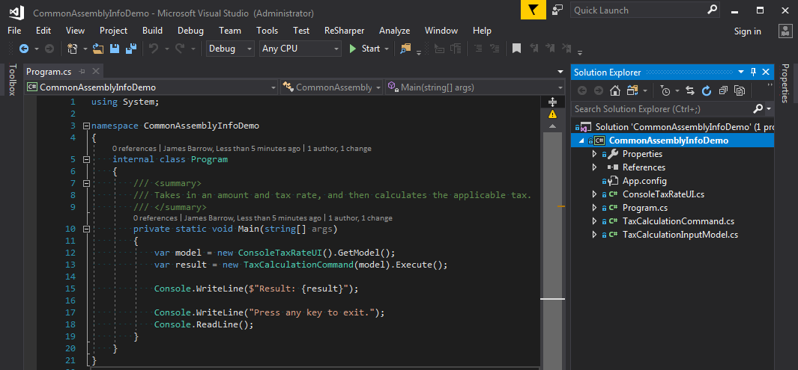
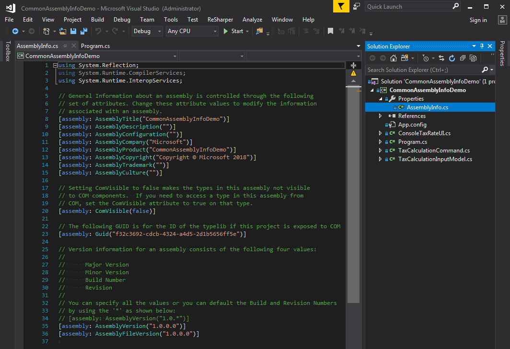
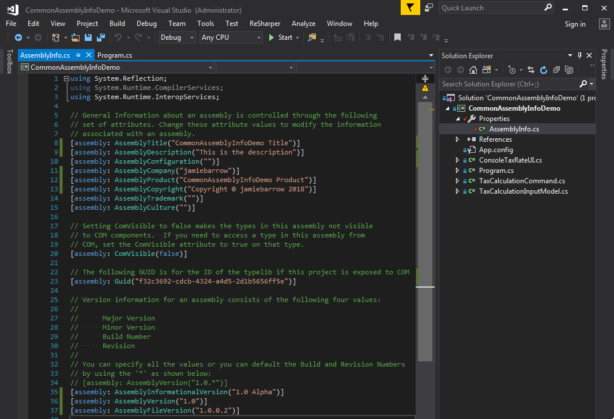
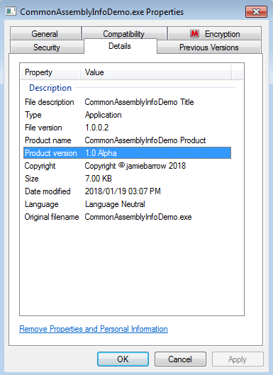
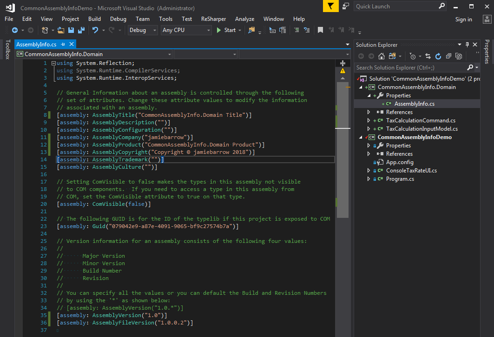
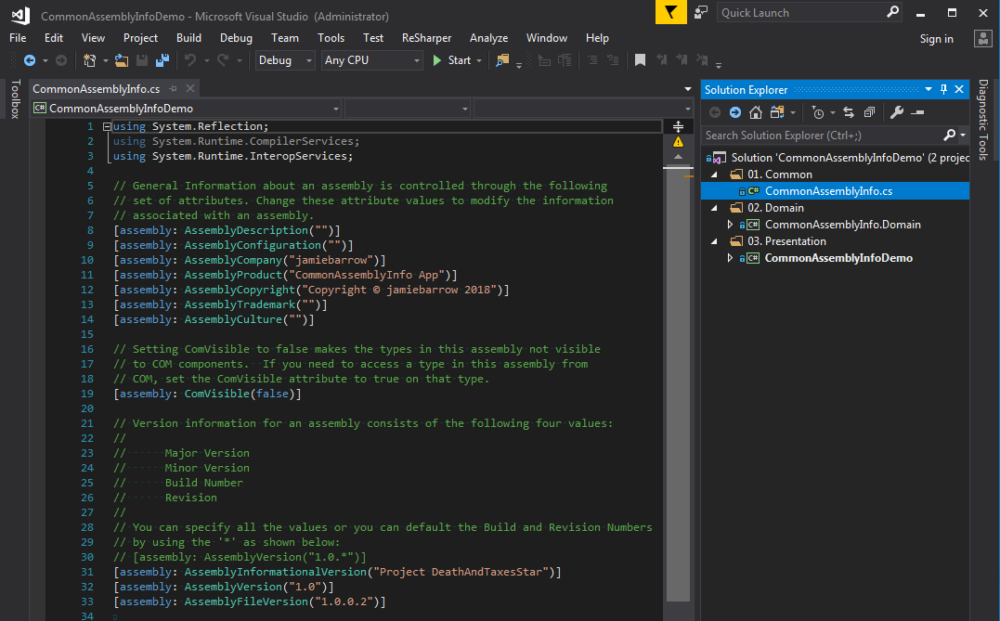
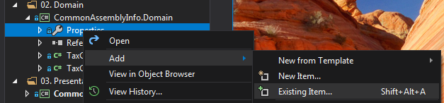
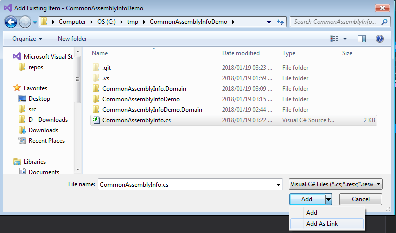
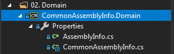
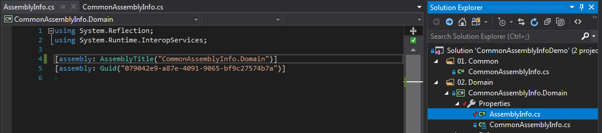

# 2018-01-19 CommonAssemblyInfo

tags: c#, tips, visual studio

I'm writing this post since I posted [this on Twitter](https://twitter.com/jamiebarrow/status/954314291838103552), and within half an hour, was asked to share my knowledge:

https://twitter.com/jamiebarrow/status/954314291838103552

In Visual Studio, there's a little known feature that lets you add files as links to a project. Using this trick, we can also ease maintenance slightly by having a CommonAssemblyInfo.cs file where common attributes across the assemblies in a solution can be applied, but maintained in a single file.

Here is the sample demo application to show the steps one normally goes through. We have an existing command line utility to calculate tax based on an entered amount and tax rate. Quite simple.

In the Properties folder there is an AssemblyInfo.cs file listing the various attributes applied to the assembly.

This isn't always set up as expected, because most people forget to look at this file. One thing that stands out for example is the Company and Copyright information is defaulted sometimes to Microsoft or some other vendor based on the system settings. This may be undesirable, and so we can update these settings.

See some links at the bottom of this page for more info on these attributes.

You can see these are shown in the properties on the executable that is built.

Maybe we go back to look at our application and want to separate out the domain aspects of the console application, perhaps because in future we may want to share that with a web application frontend. The first step one would do is creating a new project and moving the classes around, fixing references, etc.

But you'll notice that most of these attributes are the same. The only two that maybe would be different are actually just the title of the assembly and the Guid it uses. If we rename things someday, we'd have to update at least two files (maybe we rename CommonAssemblyInfoDemo to something more useful, for example).

The first thing I usually do when creating a solution with more than one project, is first creating a file called CommonAssemblyInfo.cs that lives in the same directory as the solution file (CommonAssemblyInfoDemo.sln). This is usually done outside of Visual Studio, and then using Visual Studio to add the existing item to the solution, to make it easier to edit. I also setup solution folders that are numbered to keep things nicely organised.

You'll notice that only the common attributes are left in this file. But we still need to incorporate it into the other projects.

To do this, we also need to add it as an existing item to each project, however, there is a trick - we need to add it as a link.

 

 

You'll notice in the Solution Explorer that the icon of the file has a link symbol in it, to indicate it's just a reference to an existing file, so that all links refer to the same file.

Now we just update each projects AssemblyInfo to just include the information related specifically to that project.

If we need to update the AssemblyVersion across the entire solution, it's now a simple matter of just updating the CommonAssemblyInfo file to do this, instead of going through each project and remembering to update each one.

Hope this helped someone, the extra effort when setting up a new project can sometimes save time in the future.

For example, if we had a continuous integration build, and we just wanted to update the version number across all these artifacts based on some number set in our CI system, we could just update the CommonAssemblyInfo file before we run the solution through the build.

<h4>Links</h4>

- [Sample Code](https://github.com/jamiebarrow/CommonAssemblyInfoDemo)
    - [Setting Assembly Attributes](https://docs.microsoft.com/en-us/dotnet/standard/assembly/set-attributes)
    - [What are differences between AssemblyVersion, AssemblyFileVersion and AssemblyInformationalVersion?](https://stackoverflow.com/q/64602/222090)
