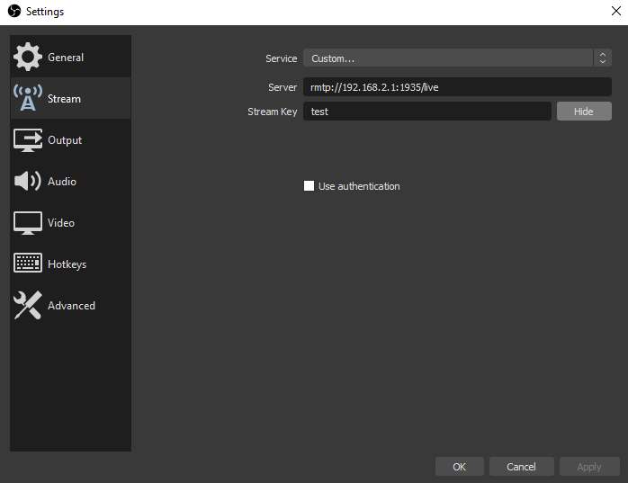

# 2020-02-08 Stream OBS to Chromecast via VLC

tags: cast, chrome, chromecast, obs, obs studio, rtsm, stream, vlc

Often I will watch YouTube or Netflix and would rather watch it on the big screen instead of on my laptop or phone.
I bought myself a Chromecast while staying in Tilburg last year and I really enjoyed being able to finally watch Netflix
on a big TV screen.

Not all apps support streaming to Chromecast though, so you sometimes need to do other tricks like in Chrome for example
you can cast your tab, or cast your entire desktop to the Chromecast, which is also pretty cool! One downside to this
though is that if you switch to another app then you're streaming the other app on your desktop and not what you were
trying to stream.

I'm a long time viewer of [Baumi's DotA videos on YouTube](https://www.youtube.com/user/l34Um1), and he actually runs a Twitch stream and later uploads his videos
that he thinks are worth keeping up onto YouTube. I've also recently started seeing people do streams of live coding,
such as [Kent C. Dodds](https://www.youtube.com/user/kentdoddsfamily). I thought this was pretty cool and wondered if I could do it myself someday.

Most people appear to use [OBS Studio](https://obsproject.com/) to compose video and images and other things in setting up their stream. It can both
stream but also record videos, and initially I had tried it out before to try record videos to maybe create a training
course at some point (still an idea for me, but maybe you'll see me create a [Pluralsight](https://www.pluralsight.com/) or [Udemy](https://www.udemy.com/) course someday).

Anyway, OBS Studio supports streaming via the [Real Time Messaging Protocol (RTMP)](https://www.adobe.com/devnet/rtmp.html).
I wondered if I could stream from OBS to my Chromecast but it seemed as if it did not support this protocol.

After some Googling though, I came across a forum post somewhere (don't seem to be able to find the link) which mentioned
that you can play the stream via VLC, and then render this stream to the Chromecast.
Just what I would need, awesome! But then I needed an rtmp server to stream to, and luckily I found someone had created
a Docker image which hosts nginx and a module that supports rtmp. Amazing!

So here are the steps to stream from OBS to Chromecast:

1. Pull the docker image
     ```shell
     docker run -d -p 1935:1935 --name nginx-rtmp tiangolo/nginx-rtmp
     ```
2. Run the docker containers as below
     ```shell
     docker run -d -p 1935:1935 --name nginx-rtmp tiangolo/nginx-rtmp
     ```
3. You can verify the log of the container using:
     ```shell 
     docker logs nginx-rtmp
     ```
4. Change the VLC renderer to use your Chromecast via the menu `Playback > Renderer > {Your Chromecast}`
5. Setup your OBS stream settings
     

6. Start streaming

7. Enjoy watching on your TV!

#### Troubleshooting

If you want to verify that your RTMP stream is working, you can either try play directly in VLC, or you can also try to dump the stream to a file using [`rtmpdump`]() (see the [downloads](http://rtmpdump.mplayerhq.hu/download/) for a binary to download)

```shell
rtmpdump -r rtmp://192.168.2.1/live/test
```

This should output a bunch of garbage to the console if the stream is running, but if you would like you can also output
it to a video file that you can then try open in VLC (press <kbd>CTRL+C</kbd> to stop outputting the stream to the file):
```shell
rtmpdump -r rtmp://192.168.2.1/live/test > test.flv
RTMPDump v2.3
(c) 2010 Andrej Stepanchuk, Howard Chu, The Flvstreamer Team; license: GPL
WARNING: You haven't specified an output file (-o filename), using stdout
Connecting ...
INFO: Connected...
Starting download at: 0.000 kB
INFO: Metadata:
INFO:   Server                NGINX RTMP (github.com/arut/nginx-rtmp-module)
INFO:   width                 1280.00
INFO:   height                720.00
INFO:   displayWidth          1280.00
INFO:   displayHeight         720.00
INFO:   duration              0.00
INFO:   framerate             30.00
INFO:   fps                   30.00
INFO:   videodatarate         3000.00
INFO:   videocodecid          0.00
INFO:   audiodatarate         160.00
INFO:   audiocodecid          0.00
INFO:   profile
INFO:   level
2368.532 kB / 162.37 sec
```

### References:

- [nginx-rtmp on Docker Hub](https://hub.docker.com/r/tiangolo/nginx-rtmp/)
- [nginx-rtmp-docker module](https://github.com/tiangolo/nginx-rtmp-docker)
- [rtmpdump](https://rtmpdump.mplayerhq.hu/)