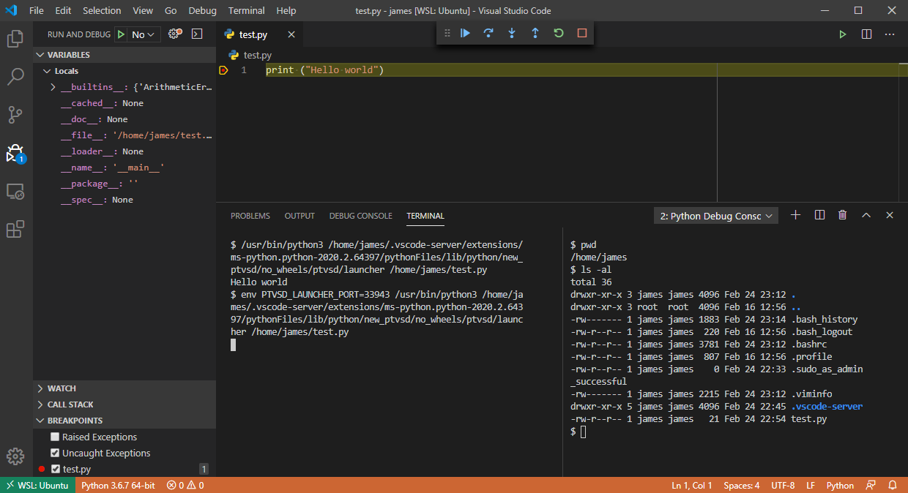
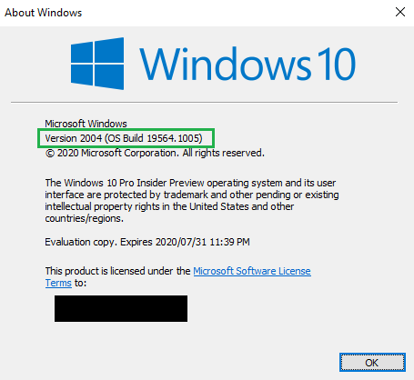
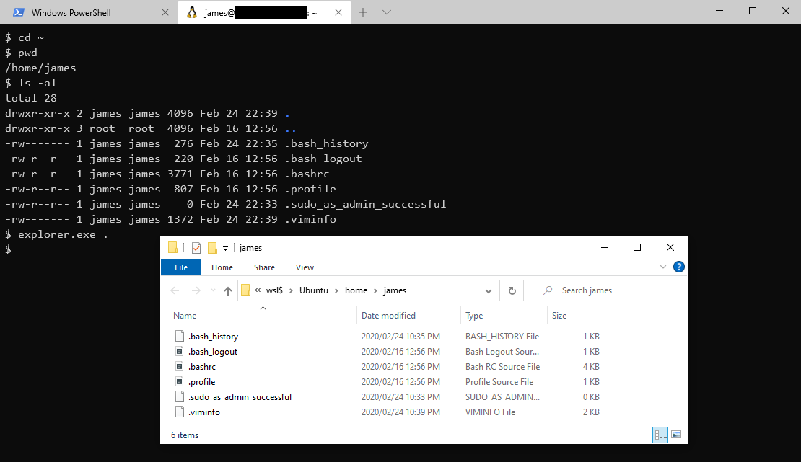

# 2020-02-15 Windows Subsystem for Linux

tags: linux, terminal, windows, wsl, wsl2

If you are not sure whether you should read this post, the below screenshot is
of an instance of Visual Studio Code, running on Windows 10. In fact, it is all
running on Windows 10, except it is also running and debugging a simple Python
script that is located and executing on the Ubuntu Linux installation on the
machine, using native Linux commands but connected through VS Code on Windows!
I've even got a Linux bash terminal open on the right running Linux commands
from VS Code. If that blew your mind like it does mine, the read on ;) 



Scott Hanselman was showing [how to set up a Windows 10 machine for Linux Development with the Windows Subsystem for Linux (WSL)](https://www.youtube.com/watch?v=j0PPcUUtHlw).
I saw him post about it on his blog before but never really paid much attention since normally the first thing I do
when I have a fresh install of Windows is to install [Git for Windows](https://gitforwindows.org/)
which comes with Git BASH, and I also install [ConEmu](https://conemu.github.io/)
as my terminal because of all its cool features. If there is anything missing
I'll install GNU Core Utilities for Windows for the rest (e.g. using `tail` instead
of remembering how to [tail with PowerShell](/blog/2017-03-23/tail-on-windows-with-powershell).

The reason I do this is because back in the day I used Linux a lot and am quite
familiar with all the different utilities provided by most basic Linux setups running `bash`.
To me they are a lot easier to use than having to learn and remember PowerShell (for now?).
These utilities are actually all compiled to Windows though, so they're not the
actual Linux commands, they're just ported versions running on Windows.

However today I learned that Windows and Linux work _really_ well together with [WSL 2](https://devblogs.microsoft.com/commandline/wsl-2-is-now-available-in-windows-insiders/).

I ran Windows Update to get a more recent version of Windows,
enabled the Windows Subsystem for Linux Windows Feature,
and then went to the Microsoft Store to install [Ubuntu](https://wiki.ubuntu.com/WSL).
Note that if you really want the [full power of WSL 2](https://aka.ms/wsl2) you need to also get onto
the insiders track of Windows Update, so do so at your own risk ;)

You need to be [running Windows 10 build 18917 or higher](https://docs.microsoft.com/en-us/windows/wsl/wsl2-install)
which you can check using the `winver` command (Start -> Run -> winver):



When you install the Windows Feature for WSL, also install the Virtual Machine Platform optional
components, this can be done be done via the Control Panel UI or using the below
commands:

```shell
dism.exe /online /enable-feature /featurename:Microsoft-Windows-Subsystem-Linux /all /norestart
dism.exe /online /enable-feature /featurename:VirtualMachinePlatform /all /norestart
```

You can get Ubuntu and other Linux distros from the Microsoft Store:


If you aren't sure which version of WSL is being used you can use the below to list
the distros:

```shell
> wsl -l -v
  NAME      STATE           VERSION
* Ubuntu    Stopped         1
```

And if it is still using WSL1 you can convert it to use WSL2 by using the below:

```shell
> wsl --set-version Ubuntu 2
Conversion in progress, this may take a few minutes...
For information on key differences with WSL 2 please visit https://aka.ms/wsl2
Conversion complete.

> wsl -l -v
  NAME      STATE           VERSION
* Ubuntu    Stopped         2
```

Initially I thought at this step that I would be able to run `explorer .` from within Ubuntu,
but it turned out I couldn't, and I thought I didn't have something setup right.
Turns out, I needed to actually use `.exe`, so here's an example of a Windows
Explorer window opened from an Ubuntu bash shell, that's viewing the home folder
in Ubuntu... mind blown!



Scott also demos the new [Windows Terminal](https://github.com/microsoft/terminal)
which is open source under the [MIT license](https://github.com/microsoft/terminal/blob/master/LICENSE),
makes use of Microsoft's open source [nerd font](https://www.nerdfonts.com/)
called [Cascadia Code](https://github.com/Microsoft/Cascadia-Code)
which supports things like ligatures (and based on [Scott's video on CRLF](https://youtu.be/TtiBhktB4Qg?t=207)
appears to be named after an old Smith-Corona type-writer).

Exciting times!

I remember back in the day (before Ubuntu Linux existing even) when to do
something even remotely close to this you needed to learn a lot about Linux...
partitioning and hopefully not messing up the master boot record, dual booting,
mount points, SAMBA protocol, etc. etc. and then even when you thought you
configured it right and it all was working, realising the config wasn't persisted
and finding out how to do that on system startup (or worse, rebuild the kernel) :D
Then you would still need to reboot into the other Operating System if you wanted to switch back.

Now you can run them both, at the same time! WSL1 had a translation layer that
would convert Linux system calls to Windows NT kernel functionality. WSL2 has
a lightweight Linux kernel so the Linux system calls are directly compatible.

Another interesting thing this opens up, is you should now be able to run both
Linux containers and Windows containers at the same time, instead of switching
between the two modes. Very cool. Haven't tried that yet, but perhaps I will
someday if I need to :P

### References:

- [WSL 2](https://aka.ms/wsl2)
- [Installation Instructions for WSL2](https://docs.microsoft.com/en-us/windows/wsl/wsl2-install)
- [How to set up a Windows 10 machine for Linux Development w/ WSL! Can we convert a diehard machead?](https://www.youtube.com/watch?v=j0PPcUUtHlw)
- [It's time for you to install Windows Terminal](https://www.hanselman.com/blog/ItsTimeForYouToInstallWindowsTerminal.aspx)
- [Cool WSL (Windows Subsystem for Linux) tips and tricks you (or I) didn't know were possible](https://www.hanselman.com/blog/CoolWSLWindowsSubsystemForLinuxTipsAndTricksYouOrIDidntKnowWerePossible.aspx)
- [A wonderfully unholy alliance - Real Linux commands for PowerShell with WSL function wrappers](https://www.hanselman.com/blog/AWonderfullyUnholyAllianceRealLinuxCommandsForPowerShellWithWSLFunctionWrappers.aspx)
- [Patching the new Cascadia Code to include Powerline Glyphs and other Nerd Fonts for the Windows Terminal](https://www.hanselman.com/blog/PatchingTheNewCascadiaCodeToIncludePowerlineGlyphsAndOtherNerdFontsForTheWindowsTerminal.aspx)
- [Docker Desktop for WSL 2 integrates Windows 10 and Linux even closer](https://www.hanselman.com/blog/DockerDesktopForWSL2IntegratesWindows10AndLinuxEvenCloser.aspx)
- [CoreUtils for Windows](http://gnuwin32.sourceforge.net/packages/coreutils.htm)
