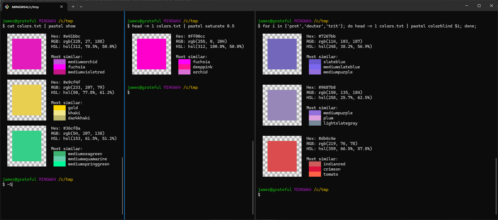

# 2024-08-14 - sharkdp.pastel

So I have been trying to get back to the command line. In recent months I've discovered and rediscovered some great CLI must haves:

- `zoxide`, for switching easily between previously visited directories
- `fzf`, for fuzzy finding files
- `bat`, an improved version of cat
- `ripgrep`, fast grep
- `fd`, fast find

I use winget on Windows and the fd and bat commands are from the `sharkdp.bat` and `sharkdp.fd` packages respectively. So out of curiousity I did `winget search sharkdp`, and stumbled across some other really nice tools, but one that caught my eye was `pastel`.

With `pastel` you can view and manipulate colors from the command line.
As a web designer/developer, this will come in handy for sure!

